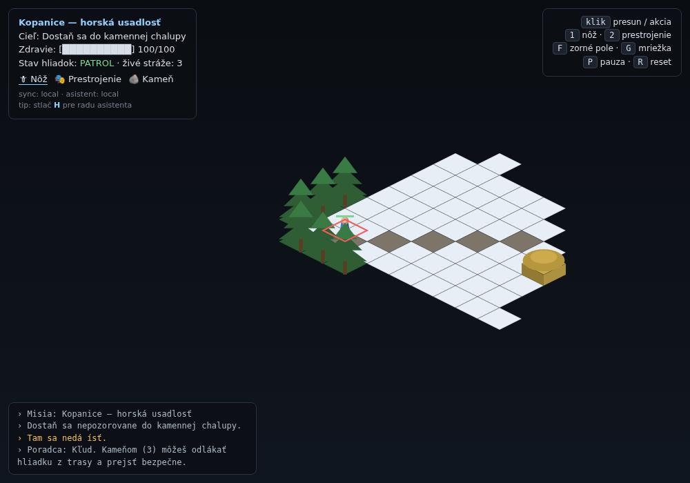

# Operácia Kopanice

A functional core for a **2D isometric, grid-based tactical stealth game**, built
on a from-scratch **Entity–Component–System (ECS)** engine in TypeScript. You
play an agent infiltrating a snow-bound mountain homestead in the Kopanice
region: slip past patrols, exploit terrain and cover, and reach the stone
cottage unseen.



> Slovak is the in-game language (HUD, log, advisor). The code and docs are in
> English.

## Highlights

| Brief requirement | Where it lives |
|---|---|
| **ECS architecture** — entities = components | `src/core/ecs/` (`World`, `Component`, `System`, `EventBus`) |
| **Isometric tilemap renderer** with depth + volume | `src/systems/RenderSystem.ts`, `src/core/math/iso.ts` |
| **A\* pathfinding** with terrain costs (snow/mud/road) | `src/map/Pathfinding.ts`, `src/core/util/BinaryHeap.ts` |
| **Vision (FoV) raycasting** honouring a height map | `src/map/Fov.ts`, `src/systems/VisionSystem.ts` |
| **Enemy AI FSM**: Patrol → Suspicious → Alert | `src/ai/FSM.ts`, `src/ai/enemyFsm.ts`, `src/systems/AISystem.ts` |
| **Skill system** with code hooks (`knifeAction`, `disguiseAction`, …) | `src/skills/` |
| **Positional 2D audio** with occlusion | `src/systems/AudioSystem.ts`, `public/assets/audio.json` |
| **All assets as readable text/JSON** | `public/assets/*.json` |
| **GitHub + cloud DB + Claude Code** integrations | `.github/`, `src/integrations/`, `api/assistant.ts` |

## Quick start

```bash
npm install
npm run dev        # http://localhost:5173
```

Other scripts:

```bash
npm run build      # type-check + production bundle to dist/
npm run preview    # serve the production build
npm run test       # unit tests (pathfinding, FoV, ECS, FSM, inventory)
npm run typecheck  # tsc --noEmit
```

## Controls

| Input | Action |
|---|---|
| **Left click** | Move to the tile (A\* path), or resolve an armed skill |
| **Right click** | Move (also cancels a skill aim) |
| **1 / 2 / 3** | Knife (🗡) · Disguise (🎭) · Stone (🪨) |
| **H** | Ask the tactical assistant for a hint |
| **F / G** | Toggle vision overlay / grid |
| **P / R** | Pause / reset the mission |

Reach a cottage floor tile to win; getting cornered by an alerted guard fails
the mission.

## How the systems fit together

The game is a fixed-order schedule of systems run every frame against one
`World` (see `src/game/Game.ts`):

```
Input → Skill → Movement → Vision → AI → Audio → Sync → Assistant → Render
```

- **Movement** advances agents along A\* paths; speed scales inversely with tile
  cost, and entering a tile emits a footstep sound whose loudness depends on the
  terrain (snow is loud, road is quiet).
- **Vision** recomputes each viewer's field of view by raycasting across a cone,
  with occlusion driven by the per-tile **height map** — walls and trees block
  line of sight, low hay bales do not.
- **AI** runs every guard through a finite-state machine. Footsteps and thrown
  stones feed a suspicion model that drives `PATROL → SUSPICIOUS → ALERT`
  transitions; a disguise slows how fast guards grow suspicious.
- **Audio** synthesises every sound from the bank (oscillator/noise — no binary
  audio files), then attenuates by distance, pans by screen offset, and muffles
  by counting blockers between the source and the listener.
- **Render** draws the world in isometric projection with a depth-sorted pass
  (ground diamonds, extruded tiles/props for volume, procedurally-shaded
  characters), then fog-of-war and overlay passes.

See [`CLAUDE.md`](CLAUDE.md) for a deeper architecture tour.

## Assets are data

Everything visual and audible is a readable JSON file under `public/assets/`:

- `tiles.json` — the tile palette: movement cost, footstep noise, walkability,
  vision-blocking, height, decoration, and colours.
- `maps/kopanice.json` — the level as ASCII terrain rows + an elevation layer +
  entity placements. Authored by `scripts/genmap.mjs` (`node scripts/genmap.mjs`).
- `sprites.json` — procedural character definitions (palette + proportions); the
  renderer draws them as shaded isometric volumes, so no image files are needed.
- `audio.json` — the synthesised sound bank and occlusion tuning.

### Extending

- **New skill:** implement the `Skill` interface (`src/skills/types.ts`) and
  `registry.register(...)` it in `src/game/Game.ts`. The hook gets a
  `SkillContext` with the world, target, logging, and sound emission.
- **New tile:** add an entry to `tiles.json` and a legend char in the map.
- **New map:** add `public/assets/maps/<name>.json` and load it via
  `loadAssets('<name>')`.

## Integrations

- **GitHub** — CI in `.github/workflows/ci.yml` runs typecheck, tests, and build
  on every push/PR.
- **Cloud database (Firebase Realtime)** — `src/integrations/sync/` persists the
  player's position, health, inventory, and disguise. With Firebase env vars set
  it syncs to the Realtime Database (SDK loaded lazily from the CDN — no build
  dependency); otherwise it falls back to `localStorage`. See `.env.example`.
- **Claude Code assistant** — press **H** for a tactical hint. With
  `VITE_ASSISTANT_ENDPOINT` set, the request goes to the serverless function in
  `api/assistant.ts`, which calls the Claude API server-side (key stays off the
  client). With no endpoint, a deterministic local advisor answers, so the
  assistant always works offline.

## Deploy (Vercel)

The repo is a static Vite build plus one serverless function:

1. Import the repo into Vercel (framework preset: **Vite**, config in
   `vercel.json`).
2. To enable cloud sync and/or the Claude assistant, set the variables from
   `.env.example` in the Vercel project (`ANTHROPIC_API_KEY` server-side;
   `VITE_*` for the client).
3. `npm run build` → `dist/` is served statically; `api/assistant.ts` is
   deployed as a function at `/api/assistant`.

## Project layout

```
src/
  core/            ECS (World/Component/System/EventBus), math, camera, input
  components/      Position, Movement, Render, Vision, AIComp, Skills, Inventory…
  systems/         Input, Skill, Movement, Vision, AI, Audio, Sync, Assistant, Render
  map/             TileMap, tile defs, A* pathfinding, FoV raycasting
  ai/              generic FSM + enemy state machine
  skills/          skill registry + knife / disguise / stone hooks
  integrations/    sync (Firebase + local), Claude assistant, config
  game/            Game orchestration + entity spawners
  main.ts          bootstrap + HUD
public/assets/     tiles.json, sprites.json, audio.json, maps/kopanice.json
api/assistant.ts   serverless Claude endpoint
test/              unit tests
scripts/genmap.mjs level authoring tool
```

## License

MIT.
