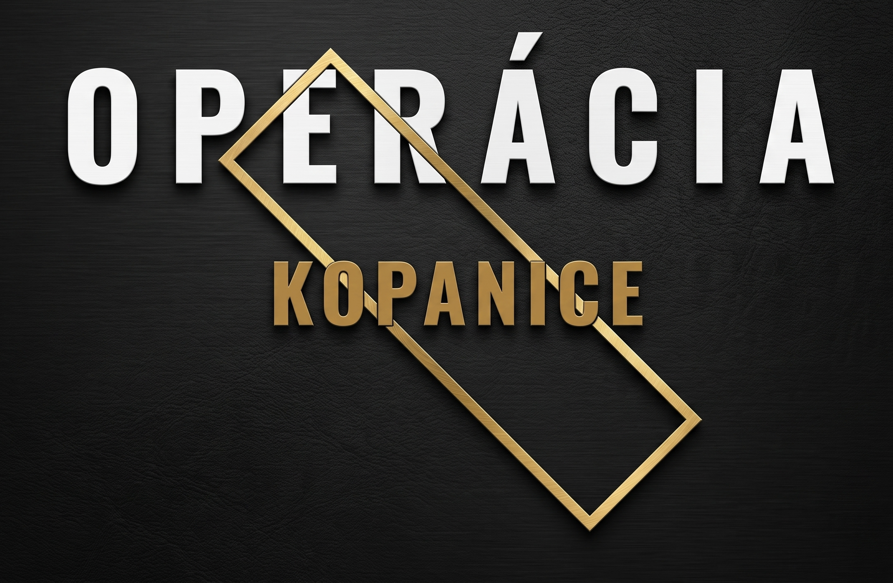
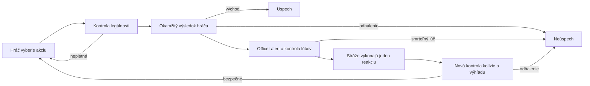
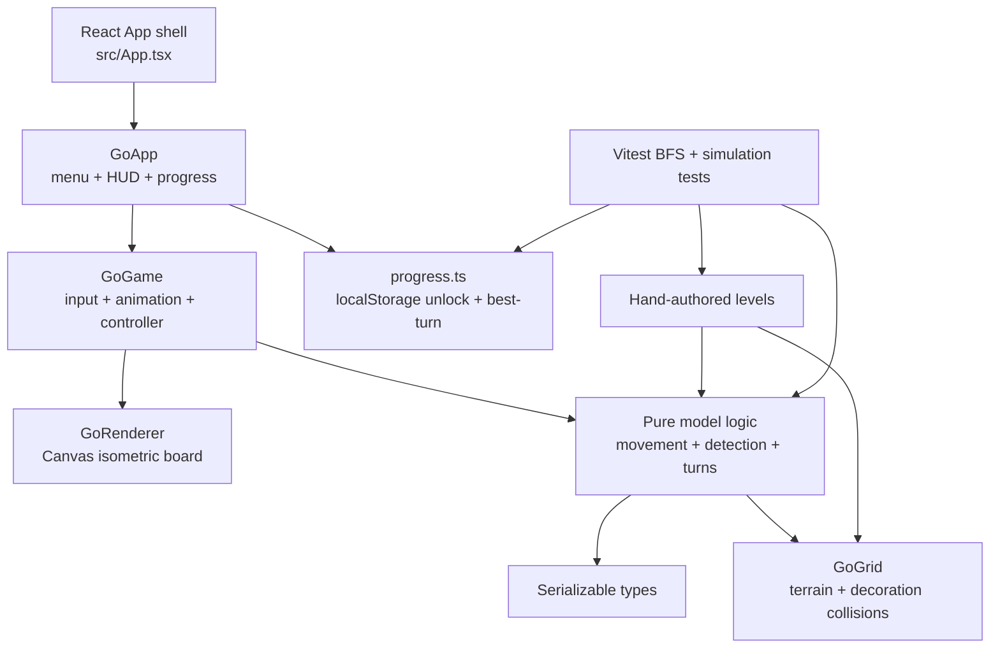

# Operácia Kopanice

<p align="center">
  
</p>

<p align="center">
  <strong>Ťahová izometrická stealth puzzle hra zo zasneženej slovenskej kopaničiarskej osady.</strong><br>
  Každý krok je rozhodnutie. Každá reakcia stráže je predvídateľná.
</p>

<p align="center">
  <a href="#-rýchly-štart">Rýchly štart</a> ·
  <a href="#-ako-sa-hra">Ako sa hrať</a> ·
  <a href="#-herná-logika">Herná logika</a> ·
  <a href="#-architektúra">Architektúra</a> ·
  <a href="#-testovanie">Testovanie</a>
</p>

<p align="center">
  <a href="https://github.com/bucala/Operacia-Kopanice/actions/workflows/ci.yml"></a>
  
  
  
  
  
</p>


> **Stav projektu:** hrateľný webový prototyp s ôsmimi ručne navrhnutými GO misiami, deterministickou stealth logikou, izometrickým Canvas rendererom, responzívnym HUD-om a lokálnym ukladaním postupu. Typecheck, testy (53/53) a produkčný build sú vynútené CI na každý push a pull request.

<details>
<summary><strong>Obsah README</strong></summary>

- [Čo je Operácia Kopanice?](#-čo-je-operácia-kopanice)
- [Rýchly štart](#-rýchly-štart)
- [Ako sa hrať](#-ako-sa-hrať)
- [Herná logika](#-herná-logika)
- [Misie](#-misie)
- [Technické riešenie](#-technické-riešenie)
- [Architektúra](#-architektúra)
- [Štruktúra projektu](#-štruktúra-projektu)
- [Testovanie](#-testovanie)
- [Vizuálny smer](#-vizuálny-smer)
- [Historický a dizajnový kontext](#-historický-a-dizajnový-kontext)
- [Roadmap](#-roadmap)
- [Licencia](#-licencia)

</details>

## 🎯 Čo je Operácia Kopanice?

Operácia Kopanice je taktická hra na uzloch mriežky v štýle **Lara Croft GO** a **Deus Ex GO**. Hráč vedie partizána cez zimnú osadu, číta zorné lúče nepriateľov, načasuje pohyb a vyčistí cestu bez zbytočného poplachu.

Hra je postavená na jednoduchom, ale prísnom rytme:

1. **Vyber jeden krok alebo interakciu.**
2. **Sleduj okamžitý dôsledok.**
3. **Nechaj stráže vykonať presne jednu reakciu.**
4. **Uprav plán alebo použi neobmedzené vrátenie ťahu.**
5. **Dostaň sa k východu.**

Nejde o hru založenú na náhode alebo reflexoch. Každá mapa je malý logický problém a každá herná situácia sa dá reprodukovať z rovnakého stavu.

## 🚀 Rýchly štart

Projekt je pnpm monorepo. Herný web je artefakt `@workspace/operacia-kopanice`.

### Požiadavky

- Node.js s podporou ES modules
- pnpm
- moderný prehliadač s podporou Canvas 2D

### Inštalácia

```bash
pnpm install
```

### Vývojový server

```bash
pnpm --filter @workspace/operacia-kopanice run dev
```

Artifact workflow automaticky dodáva `PORT` a `BASE_PATH`. Pri ručnom spustení ich nastavte:

```bash
PORT=22332 BASE_PATH=/ \
  pnpm --filter @workspace/operacia-kopanice run dev
```

### Produkčný build

```bash
PORT=22332 BASE_PATH=/ \
  pnpm --filter @workspace/operacia-kopanice run build
```

Výsledok vznikne v:

```text
artifacts/operacia-kopanice/dist/public/
```

### Kontroly kvality

```bash
pnpm --filter @workspace/operacia-kopanice run typecheck
pnpm --filter @workspace/operacia-kopanice run test
pnpm --filter @workspace/operacia-kopanice run build
```

## 🎮 Ako sa hrať

### Ovládanie

| Akcia | Klávesnica | Myš / dotyk |
|---|---|---|
| Pohyb po mriežke | `↑` `↓` `←` `→` alebo `WASD` | Klik na susedný uzol |
| Čakanie | `Space` alebo `.` | Klik na vlastný uzol |
| Aktivácia generátora / zvona | `E` | Klik na objekt, keď na ňom stojíš |
| Hodenie kameňa | `E` | Klik na kameň pred hráčom |
| Vrátiť ťah | `U` alebo `Z` | Tlačidlo **Späť** |
| Reštartovať misiu | `R` | Tlačidlo **Reset** |
| Otvoriť menu | `Esc` | Tlačidlo **Menu** |

Držanie klávesov `U`, `Z` alebo `R` nespôsobí opakované vykonanie akcie.

### Základný cieľ

Na každej mape sa dostaň na políčko **východu**. Ak vstúpiš do smrtiaceho zorného poľa, narazíš do stráže spredu alebo stráž po reakcii získa priamy výhľad, misia končí neúspechom.

### Tiché zneškodnenie

Na políčko stráže môžeš vstúpiť iba vtedy, keď útok nie je čelný. Pohyb zo strany alebo zozadu stráž ticho zneškodní. Pohyb priamo do smeru, ktorým sa stráž pozerá, znamená odhalenie.

## 🧠 Herná logika

### Jedna akcia, jedna reakcia


```mermaid
flowchart LR
    A[Hráč vyberie akciu] --> B[Kontrola legálnosti]
    B -->|neplatná| A
    B --> C[Okamžitý výsledok hráča]
    C -->|východ| W[Úspech]
    C -->|odhalenie| L[Neúspech]
    C --> D[Officer alert a kontrola lúčov]
    D -->|smrteľný lúč| L
    D --> E[Stráže vykonajú jednu reakciu]
    E --> F[Nová kontrola kolízie a výhľadu]
    F -->|bezpečné| A
    F -->|odhalenie| L
```

Logika je rozdelená do čistých funkcií. Canvas, DOM, animácie ani náhodnosť nie sú súčasťou jadra pravidiel. Vďaka tomu sa rovnaký stav dá použiť v hre, v undo zásobníku aj v BFS solveri testov.

### Stráže

| Typ | Správanie | Čo treba sledovať |
|---|---|---|
| **Dôstojník / sentry** | Stojí na mieste a môže rotovať cez pevný cyklus smerov. | Vnútorné políčka lúča sú smrtiace. Posledné políčko lúča spúšťa officer alert. |
| **Pešiak / patrol** | Pohybuje sa po ručne zadanej trase tam a späť. | Smer pohybu, trasa, zorný rozsah a zmeny po poplachu. |
| **Sniper** | Vizuálna varianta sentry stráže s dlhším zorným lúčom. | Dlhá priama línia a načasovanie rotácie. |
| **Machinegunner** | Vizuálna varianta patrol stráže. | Pohyb po trase a pokrytie chodníkov. |

### Zorné lúče a dôstojnícky poplach

- Stráž vidí v smere svojho `facing` cez kardinálne susedné uzly.
- Steny, zavreté brány, stromy a skaly blokujú výhľad.
- Zorný lúč sa vykresľuje na mape ako nebezpečná červená zóna.
- **Vnútorné políčka dôstojníka sú stále smrtiace.**
- Vstup na posledné viditeľné políčko dôstojníka spustí varovanie namiesto okamžitej smrti.
- Blízki pešiaci v manhattanskej vzdialenosti najviac dva uzly sa označia ako `alerted` a deterministicky zmenia smer patrolovania.
- Pri prekrývajúcich sa lúčoch sa okrajová výnimka uplatňuje iba na konkrétneho dôstojníka; cudzí vnútorný lúč zostáva smrtiaci.

### Terminály a brány

Terminál je interaktívny uzol, ktorý po vstupe prepne pripojenú bránu:

```text
hráč vstúpi na terminál
        ↓
brána sa otvorí alebo zatvorí
        ↓
zmení sa pohyblivosť aj priechodnosť výhľadu
        ↓
hráč pokračuje v rovnakom ťahu podľa výsledku
```

### Odvrátenie pozornosti

Všetky distraction objekty sú deklarované priamo v definícii misie. Každý sa dá použiť iba raz a jeho stav sa ukladá do undo/reset snapshotu.

| Objekt | Aktivácia | Efekt |
|---|---|---|
| **Generátor** | Hráč na ňom stojí, potom `E` | Živé stráže v dosahu sa na jednu reakciu otočia do pevne zadaného smeru. |
| **Kameň** | Hráč stojí o jedno políčko ďalej a pozerá smerom na kameň, potom `E` | Kameň sa hodí o jedno políčko pred hráča; stráže v dosahu otočí na zadaný smer. |
| **Zvon** | Hráč stojí na zvone, potom `E` | Stráže v dosahu sa otočia smerom k zvonu; smer sa vypočíta pre každú stráž zvlášť. |

Každá aktivácia spotrebuje presne jeden ťah. Neživé stráže sa ignorujú a stráže mimo manhattanského rozsahu na efekt nereagujú.

## 🗺️ Misie

Misie sú malé ručne autorské puzzle. Testovací BFS solver prechádza všetky legálne akcie a kontroluje, že víťazná cesta existuje v stanovenom limite.

| # | Názov | Hlavná myšlienka |
|---:|---|---|
| 1 | **Zácvik** | Základný zorný lúč, východ a prvý generátor. |
| 2 | **Hliadka** | Rotujúci dôstojník, pohybujúci sa pešiak a načasovanie. |
| 3 | **Terminál** | Hacknutie terminálu a otvorenie brány. |
| 4 | **Ulička** | Úzky koridor medzi domami a bezpečný okamih rotácie. |
| 5 | **Prejazd** | Dvor s jedným vstupom, dôstojníkom a pešiakom. |
| 6 | **Prielom** | Terminál, zavretý východ a štvorfázová rotácia. |
| 7 | **Kameň** | Prvý puzzle založený na hodení kameňa. |
| 8 | **Výpadok** | Generátor je jediný spôsob, ako prekonať statickú stráž. |

Nová misia sa pridáva ako deklaratívny `GoLevel` v `src/go/levels/index.ts`. Nie je potrebné písať nový renderer ani nový stavový automat.

## 🛠️ Technické riešenie

### Vykresľovanie

- HTML Canvas 2D renderer.
- Izometrická projekcia diamantovej mriežky.
- Samostatné vykresľovanie terénu, nebezpečných políčok, postáv, objektov a dekorácií.
- Interpolácia vizuálnych pozícií oddeľuje plynulú animáciu od okamžitej zmeny logického stavu.
- Sprite cache zjednocuje načítanie obrázkov a variantov postáv.
- DOM overlay obsahuje menu, top bar, enemy panel, hint bar a outcome obrazovky.

### Terén a kolízie

Podporované typy buniek:

```text
void  floor  road  plank  mud  wall  tree  rock  exit
```

Domy, stromy, skaly, debny a ploty sú vizuálne deklarácie nad logickou mriežkou. Domy a stromy sú štandardne pevné; ľahké dekorácie môžu mať explicitne zapnuté alebo vypnuté blokovanie pohybu a výhľadu.

### Stav a undo

Runtime stav je serializovateľný a obsahuje:

```text
player
guards
gates
terminals
distractions
phase
outcome
turn
```

Undo preto obnovuje celý stav na hranici ťahu — nielen pozíciu hráča. Reset reštartuje iba aktuálnu misiu a nemení uložené odomknutie levelov.

### Ukladanie postupu

Postup a najlepšie výsledky sú uložené v `localStorage` prehliadača. Hra nepotrebuje účet ani sieťové volanie na samotné hranie.

## 🏗️ Architektúra


```mermaid
flowchart TB
    React[React App shell<br/>src/App.tsx] --> App[GoApp<br/>menu + HUD + progress]
    App --> Game[GoGame<br/>input + animation + controller]
    App --> Progress[progress.ts<br/>localStorage unlock + best-turn]
    Game --> Renderer[GoRenderer<br/>Canvas isometric board]
    Game --> Logic[Pure model logic<br/>movement + detection + turns]
    Logic --> Types[Serializable types]
    Logic --> Grid[GoGrid<br/>terrain + decoration collisions]
    Levels[Hand-authored levels] --> Grid
    Levels --> Logic
    Tests[Vitest BFS + simulation tests] --> Logic
    Tests --> Levels
    Tests --> Progress
```

Podrobný rozpis pravidiel, zoznam misií a modulovej mapy: [`docs/GO-DESIGN.md`](artifacts/operacia-kopanice/docs/GO-DESIGN.md). Sprite pipeline a ako pridať art: [`docs/ASSETS.md`](artifacts/operacia-kopanice/docs/ASSETS.md).

### Hlavné vrstvy

| Vrstva | Súbory | Zodpovednosť |
|---|---|---|
| **Model** | `src/go/model/types.ts` | Typy smerov, buniek, stráží, brán, terminálov, distraction objektov a runtime stavu. |
| **Pravidlá** | `src/go/model/logic.ts` | Čisté funkcie pre legálne pohyby, výhľad, detekciu, alerty, interakcie a reakcie stráží. |
| **Mriežka** | `src/go/model/grid.ts` | Prevod terénnych znakov na cell kind, bounds a kolízie dekorácií. |
| **Level design** | `src/go/levels/index.ts` | Ručne navrhnuté deklaratívne mapy, trasy, stráže a interakcie. |
| **Controller** | `src/go/GoGame.ts` | Vstup, animované dvojfázové ťahy, undo zásobník, log a callbacky pre HUD. |
| **UI shell** | `src/go/GoApp.ts` | Menu, odomykanie levelov, localStorage progress, enemy panel a outcome overlay. |
| **Renderer** | `src/go/GoRenderer.ts` | Izometrické Canvas vykresľovanie mapy, postáv, efektov a interaktívnych objektov. |
| **Postup** | `src/go/progress.ts` | Čisté funkcie pre odomykanie a best-score + `localStorage` perzistencia, degraduje bezpečne bez úložiska. |
| **Testy** | `test/go.test.ts`, `test/progress.test.ts` | BFS solvability, simulácie interakcií, kolízie, alerty, distraction objekty, undo pravidlá a odomykanie/best-score. |

## 📁 Štruktúra projektu

```text
.
├── artifacts/
│   ├── api-server/                 # spoločný API artefakt monorepa
│   └── operacia-kopanice/          # hlavný herný web
│       ├── public/                 # logo, ikony, sprity a verejné assety
│       ├── src/
│       │   ├── go/                 # GO puzzle jadro (celá hra)
│       │   │   ├── model/          # čisté pravidlá a serializovateľný stav
│       │   │   ├── levels/         # ručne definované misie
│       │   │   ├── GoApp.ts        # menu a HUD
│       │   │   ├── GoGame.ts       # controller a animácie
│       │   │   └── GoRenderer.ts   # izometrický renderer
│       │   ├── core/               # zdieľaná izo projekcia, kamera, input
│       │   ├── App.tsx, main.tsx   # tenký React mount point nad GoApp
│       │   └── docs/               # GO-DESIGN.md, ASSETS.md
│       ├── test/                   # go.test.ts, progress.test.ts
│       ├── index.html              # taktické vizuálne štýly webu
│       └── vite.config.ts          # BASE_PATH/PORT-aware Vite konfigurácia
├── .github/workflows/ci.yml        # typecheck + test + build na push/PR
├── attached_assets/                # zdrojové artworky a dizajnové podklady
├── CHANGELOG.md
├── package.json
├── pnpm-workspace.yaml
└── README.md
```

## ✅ Testovanie

Testy používajú čisté modelové funkcie bez DOM a bez Canvasu:

```bash
pnpm --filter @workspace/operacia-kopanice run test
```

Súčasťou testov je BFS solver:

1. načíta počiatočný stav levelu,
2. vygeneruje všetky legálne hráčove akcie,
3. aplikuje hráčovu polovicu ťahu,
4. posunie všetky živé stráže,
5. vyhodnotí nový stav,
6. pokračuje až po výhru, prehru alebo limit ťahov.

Pokryté sú najmä:

- riešiteľnosť všetkých ôsmich misií,
- priechodnosť terminálov a brán,
- kolízie domov, stromov, skál a dekorácií,
- tiché zneškodnenie a čelný náraz,
- rotujúce sentry a ping-pong patrol trasy,
- dôstojnícke edge alerty a prekrývajúce sa lúče,
- generátor, kameň a zvon,
- dosah a jednorazovosť distraction objektov,
- neplatná aktivácia mimo správnej pozície,
- stav distraction objektov v BFS kľúči a undo snapshot ochranách,
- odomykanie levelov, monotónnosť best-score a bezpečné správanie bez `localStorage` (`test/progress.test.ts`).

Pred odoslaním zmien odporúčame spustiť celú kontrolu:

```bash
pnpm --filter @workspace/operacia-kopanice run typecheck
pnpm --filter @workspace/operacia-kopanice run test
PORT=22332 BASE_PATH=/ \
  pnpm --filter @workspace/operacia-kopanice run build
```

CI (`.github/workflows/ci.yml`) spúšťa presne tieto tri kroky na každý push a pull request — zlyhanie ktoréhokoľvek z nich blokuje merge.

## 🎨 Vizuálny smer

Vizuál kombinuje:

- zasneženú kopaničiarsku osadu,
- realistické fotografické / predrenderované objekty,
- tmavý taktický HUD,
- mosadzné rámy a geometrickú linku loga,
- červené zóny ohrozenia,
- modré alebo svetlé zvýraznenie možného pohybu,
- výrazné portréty nepriateľov,
- responzívny enemy panel pre úzke telefónne obrazovky.

Použité hlavné assety:

- logo: `public/brand/operacia-kopanice-logo.png`
- webová ikona: `public/icon.png`
- manifest: `public/manifest.webmanifest`
- zdrojové artworky: `attached_assets/`

## 📚 Historický a dizajnový kontext

Priložený [Game Design Document](attached_assets/game_design_document_operacia_kopanice_1785576276724.pdf) zasadzuje širšiu víziu hry do obdobia Slovenského národného povstania v rokoch 1944–1945, najmä do prostredia Myjavskej pahorkatiny a Bielych Karpát.

Dokument opisuje väčšiu kampaň s partizánskou jednotkou, diverznými operáciami, špecializovanými postavami a systémami ako:

- infiltrácia železničného viaduktu,
- oslobodenie väzňa z kaštieľa,
- záchrana osady Cetuna,
- špecializácie Vodca, Ženista, Špión, Zved a Odstreľovač,
- inventár, schopnosti a audio podnety,
- rozšírený ECS model a cloudovú synchronizáciu.

Aktuálny webový artifact je zámerne užší a sústredí sa na **stabilné, hrateľné GO puzzle jadro**. GDD slúži ako dizajnový kontext a budúca vízia; prvky, ktoré nie sú uvedené v časti [Herná logika](#-herná-logika), nepovažujte za súčasť súčasného webového MVP. Plán postupného prepájania GO misií s naratívom GDD je vo [Fáze 3 roadmapy](#-roadmap).

## 🧭 Roadmap

Roadmap vychádza z priebežného auditu projektu a je rozdelená do fáz podľa naliehavosti — nie je to striktne sekvenčné poradie realizácie, ale poradie priority.

### ✅ Fáza 1 — Bezpečnostná sieť (hotovo)

Cieľ: zastaviť tiché straty (počas migrácie na pnpm workspace zmizlo CI, časť testov aj dokumentácia bez jediného PR review).

- CI (`.github/workflows/ci.yml`): typecheck + testy + build na každý push a pull request.
- Vrátené testy trvalého stavu hráča (`test/progress.test.ts` — odomykanie, best-score).
- Aktuálne `docs/GO-DESIGN.md` a `docs/ASSETS.md` namiesto zastaraných/chýbajúcich kópií.
- Odstránených ~9 000 riadkov nedosiahnuteľného real-time jadra (pôvodný ECS engine, nepoužitá shadcn/ui knižnica) a ~30 nepoužitých závislostí.

### Fáza 2 — Výkon a veľkosť

- zmenšiť/skomprimovať sprite PNG (viaceré cez 5 MB — `trees.png`, `house1.png`, `house2.png`) na skutočnú vykresľovaciu veľkosť; priamy dopad na dobu načítania na mobile,
- vyčistiť `attached_assets/` — desiatky MB konceptových renderov a duplicitných screenshotov, na ktoré README neodkazuje.

### Fáza 3 — Obsah a identita

- prepojiť GO misie s naratívnym rámcom [GDD](#-historický-a-dizajnový-kontext) — SNP 1944, partizánska brigáda Miloša Uhra — aspoň menom hráčovej postavy a krátkym úvodom pred misiou,
- zvážiť premenovanie/tematické zoskupenie misií v duchu troch kampaní z GDD,
- zapnúť pripravený, ale nevyužívaný Claude tactical-hint endpoint (`artifacts/api-server/src/routes/assistant.ts`) ako dobrovoľnú nápovedu pre zaseknutých hráčov.

### Fáza 4 — Rast

- pridať misiu, ktorú možno vyriešiť iba hodením kameňa,
- zobraziť jasný signál, kedy je okno generátora bezpečne otvorené,
- vizuálne odlíšiť prostredia misií (dnes takmer identická zasnežená dedina naprieč všetkými ôsmimi),
- rozšíriť audio a atmosférické feedbacky interakcií,
- pridať samostatnú mobilnú vrstvu bez rozbitia deterministického modelu.

## 🤝 Prispievanie

Pri pridávaní novej mechaniky:

1. definujte dátový typ v `src/go/model/types.ts`,
2. implementujte pravidlo ako čistú funkciu v `src/go/model/logic.ts`,
3. pridajte alebo upravte deklaratívnu misiu v `src/go/levels/index.ts`,
4. pridajte simulačné testy do `test/go.test.ts`,
5. doplňte render a HUD až po overení modelu,
6. spustite typecheck, Vitest a produkčný build.

CI beží automaticky na každý push a pull request a musí prejsť pred mergnutím — pozri [Testovanie](#-testovanie).

Dôležitý princíp projektu: **herná logika nesmie závisieť od DOM, Canvasu, časovača ani náhody.**

## 📄 Licencia

Projektové metadata deklarujú licenciu **MIT**. Pred verejnou distribúciou skontrolujte licenčné podmienky všetkých externých alebo generovaných artworkov v `attached_assets/` a `public/`.

---

<p align="center">
  <strong>Operácia Kopanice</strong><br>
  <sub>Naplánuj ticho. Pohni sa presne. Preži reakciu.</sub>
</p>