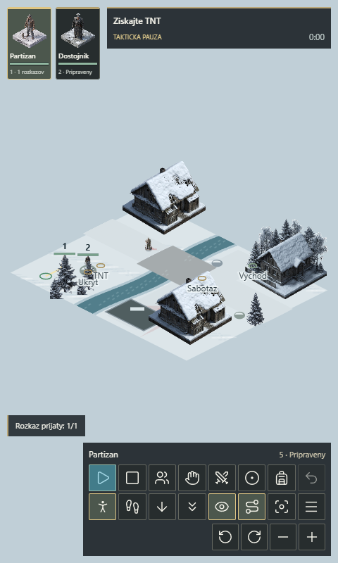

# Operacia Kopanice: Web Stealth RTT

The default entry point is `src/rt/RealtimeApp.tsx`, not `GoApp`.
Time, movement, guards, detection and cooldowns advance continuously without
waiting for player input. Deployment starts running; Space is optional tactical
pause. Opening menus freezes separately and preserves the previous pause state.
Background/focus loss requests a safety pause; it does not perform catch-up turns.

This is a lightweight Canvas adaptation using existing PNG artwork, not an Unreal
HTML5 export. Native UE uses NavMesh and 3D assets; the web uses PathFinding.js
over a 0.3 m navigation sampling field with continuous fractional-world movement.
The sampling field is not a gameplay tile board, occupancy system or turn clock.
Web art, map dimensions, collision and animation are not equivalent to UE.

## Run and Verify

Use pnpm 10 and Node.js from the workspace root:

```powershell
pnpm install --frozen-lockfile --filter '@workspace/operacia-kopanice...'
pnpm --filter @workspace/operacia-kopanice dev
pnpm --filter @workspace/operacia-kopanice typecheck
pnpm --filter @workspace/operacia-kopanice test
pnpm --filter @workspace/operacia-kopanice build
```

Dev defaults to port 3000; `$env:PORT='4175'` changes it. Production output is
`dist/public`. The Workers configuration is `wrangler.toml`; authenticated
`pnpm --filter @workspace/operacia-kopanice exec wrangler deploy` publishes it.
A source push alone does not update the Worker. No secret belongs in source.

With Playwright and Chrome installed, the repository's browser check is:

```powershell
node tools/verify-web-rtt.cjs http://localhost:3000 ./web-rtt-evidence
```

Run that command from the repository root. `PLAYWRIGHT_MODULE` can select a bundled
Playwright module and `PLAYWRIGHT_CHANNEL` can select another installed browser.
Development-only read-only diagnostics verify fractional movement, idle patrols,
group movement and pause preservation. They are stripped from production builds.
Desktop/mobile screenshots and canvas pixel checks verify visible rendered assets.
Production checks use friendly HUD positions/timing instead of development-only
diagnostics, and include narrow portrait and short landscape panel-overlap checks.



## Controls

| Action | Mouse / keyboard |
| --- | --- |
| Select a member / both | Left-click a member or portrait; 1 / 2 / 3 or Ctrl+A |
| Add or box-select | Shift + selection; left-drag selection box |
| Cycle active member, retain group | Tab |
| Move continuously | Right-click terrain; left-click terrain never moves |
| Run to destination | Right double-click; does not duplicate a paused order |
| Append destination | Shift + right-click; pause always appends |
| Optional tactical pause | Space / pause icon |
| Stop selected members | S / X / stop icon |
| Remove last waiting order | Backspace, only during tactical pause |
| Walk / run / crouch / prone | W / R / C / V |
| Contextual takedown / body pickup | Right-click living / downed guard |
| Arm takedown / distraction / carry / interaction | T / F / B / E, then left-click target |
| Cancel armed target | Right-click / Escape |
| Drop carried body | B or body icon; near the hide point this conceals it |
| Camera | Wheel zoom, middle-drag pan, arrows, Q / ] rotate, Home focus |
| Menu | Escape / menu icon |

Touch: tap a member to select; tap terrain to command; drag to pan; pinch to zoom.
Use stance/ability icons and tap targets. Gesture completion/cancellation never
issues a move. A menu or outcome prevents world orders.

## Missions and Rules

- Zimny viadukt (25 x 20 m): collect TNT, bring both members across the bridge,
  sabotage from the east bank, extract together. Water is impassable. Destruction
  rebuilds navigation so the bridge cannot be used afterwards.
- Lesny kurier (48 x 45 m): retrieve documents and extract both members.
- Tiche velitelstvo (48 x 48 m): acquire TNT, sabotage the command post, extract.

Guards dwell, turn and patrol in seconds. Near standing exposure triggers combat;
far exposure fills suspicion. Crouching/prone and nearby cover reduce detection.
Buildings, trunks and rocks block routes and sight. Noise initiates investigation,
visible bodies are suspicious, and combat warns nearby guards. Party death fails
the operation. No turn count, action points or rewind-to-turn snapshot is used.

Distraction has five charges and a six-second cooldown. Skills belong to the
active member; movement/stances apply to selected members. Takedowns require a
rear approach, then bodies can be carried slowly and hidden. The bounded 32-order
queue validates routes before replacing an existing plan. Moving targets and
destroyed bridges can invalidate an already accepted order at execution time.

## Modules and Limits

`Simulation` owns continuous gameplay, `Navigation` owns collision/path queries,
`missions` defines authored layouts and deterministic dressing, `Renderer` draws
world-space sprites/cones/routes, `Pointer` handles gestures, and `RealtimeApp`
owns lifecycle, keyboard input and the React HUD/menus. Simulation is DOM-free.
No default module imports the legacy GO rules; only its independent image cache
is reused. `src/go` and its tests remain archived regression coverage.

Current limitations: sprites are billboards without rigged walking animation;
vehicles are schematic web props; terrain/collision are planar; mobile verification
uses touch emulation, not a physical Android device. There is no packaged APK/EXE
or claim of reference-image art parity. Operation completion is per run; settings,
not campaign saves, persist in the new versioned RTT storage namespace.
