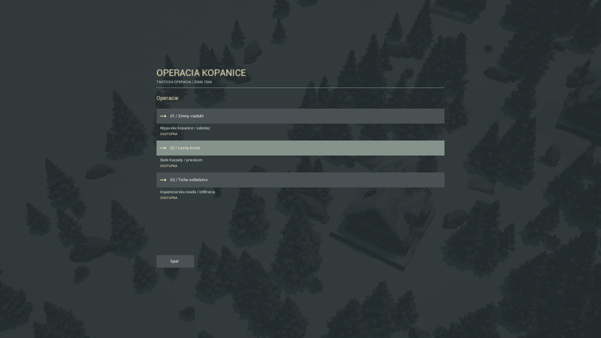
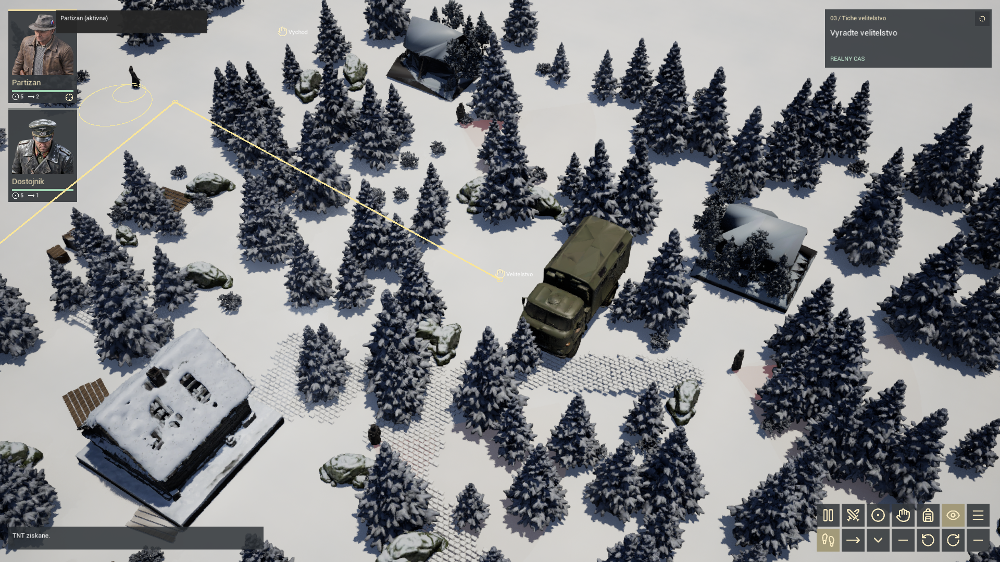

# Native RTT Campaign

The native demo contains three authored runtime missions. There is no turn/grid
simulation: the 180 cm footprint unit only sets asset scale and map dimensions.
All movement uses continuous UE NavMesh paths and the existing two-member party.

| Operation | Playable area | Patrols | Objective |
| --- | --- | --- | --- |
| 01 / Zimny viadukt | Original compact settlement | 2 | TNT, cross together, destroy bridge, extract |
| 02 / Lesny kurier | 86.4 x 86.4 m (48 x 48 footprint units) | 3 | Retrieve documents, extract both members |
| 03 / Tiche velitelstvo | 86.4 x 86.4 m (48 x 48 footprint units) | 3 | Collect TNT, disable command post, evade investigating patrol, extract |

The new missions have distinct building/vehicle layouts, patrol stops, objective
positions and safe western bypasses. Returning patrols can briefly face the route;
the main roads are not intended to be crossed blindly. The courier's north route
and the command post's western approach offer alternatives. Primary objectives
alone never win: both living members must reach the extraction radius.

## Assets and Placement

The alternate Winterwood cabin and Olive Command Caravan are derived from the
user-supplied Meshy Blender files. `Tools/prepare_mission_props.py` exports copies;
it never saves changes to the original .blend files. The delivered meshes have
approximately 297k and 180k triangles, with 1024px PBR colour/metal-rough/normal
maps, imported as Nanite meshes. These are visual props, not historical vehicle
simulation or an asserted exact model identification.

The maps also reuse the supplied cabin, black car, two fir variants, winter shrub,
limestone rocks, cobblestone courtyards, wooden paths and supply crates. Deterministic
HISM scattering produces hundreds of decorative forest instances per mission.
Buildings, vehicles, tactical rocks and crate cover have separate collision/nav
proxies. Decorative forest instances do not block navigation. Crouched concealment
uses the tagged tactical cover positions, not every decorative shrub.

Runtime placement normalizes mesh pivots, fits bounds uniformly and accounts for
different imported vehicle axes. Cabin envelopes remain 720 x 720 cm, cars fit
540 x 360 cm and the command vehicle fits 900 x 360 cm before world rotation.
The larger maps use a snow surface and imported courtyard/path clusters; terrain
sculpting, dense road-edge dressing and final art polish remain future work.

## Menu Flow

Normal startup opens the main menu over the real scene. Select an operation,
read its briefing and deploy. Deployment and restarting preserve the mission ID
through OpenLevel URL options; they do not always reload Mission 1. The initial
planning pause waits for navigation construction and connected objective/exit paths.
Pause and menu requests are ignored during that construction to avoid stopping
the navigation builder before it can finish.

The menu includes main/pause screens, mission selection, briefing, results with
next-operation navigation, graphics/camera/interface settings, and separate
restart/quit confirmations. Escape backs out one page at a time. Resuming the
menu preserves a pre-existing tactical pause and the party's queued orders.
The objective-panel crosshair focuses the current objective on larger maps.

Preferences and completed-operation flags are saved in local GameUserSettings.
They are not a mid-mission save system: closing or restarting loses the active
mission's unfinished progress. Audio mixing, remappable bindings, gamepad menus,
Android packaging and cloud saves are not implemented by this pass.

## Launch and Verification

```powershell
./Start-Demo.ps1 -Build
./Start-Demo.ps1 -CampaignSmokeTest -Mission 1 -Width 1920 -Height 1080
./Start-Demo.ps1 -CampaignSmokeTest -Mission 1 -Width 480 -Height 800
./Start-Demo.ps1 -SmokeTest -Width 1920 -Height 1080
./Start-Demo.ps1 -MissionSmokeTest
```

The campaign fixture uses the real HUD callbacks to traverse menus and deploy from
Mission 2 results into Mission 3. It uses production navigation/interaction orders
with every enemy brain active, without teleporting, killing guards or granting
invulnerability. Fixtures do not overwrite player preferences. See
[verification](REALTIME_VERIFICATION.md) for completed runs and remaining gaps.
This is a Windows editor-hosted UE demo; the legacy web game remains separate.

## Captured Build

These are in-engine captures, not the target-art reference:





[Portrait mission selection, 480 x 800](Evidence/2026-10-07/Campaign-Menu-480x800.png)
